# The core dependency map

The prerequisite graph, drawn. Every edge here is a **hard prerequisite** declared in
[`registry/`](registry/) or a published `topic.yml`, and every edge is checked in CI: no cycles,
and no prerequisite at a higher level than the topic requiring it.

**Why this exists.** Learning order is not a matter of taste. "Learn Kubernetes" is not actionable
for someone who does not know what a process is, and the reason is a dependency, not an opinion.
This map is the answer to *what am I missing?* — which is the most useful question a learner can
ask and the hardest to answer alone.

**How to read it.** Arrows point from prerequisite to dependent: `A → B` means "learn A before B".
Diagrams are grouped by area for legibility; the graph itself is one connected structure, not
several. A **thick border** means the topic is written; everything else is declared in the map and
not yet written — see
[architecture.md §4](../docs/architecture.md#4-the-registry-and-the-no-empty-files-rule) for why
that is deliberate rather than a gap in the map.

**Each diagram ships twice.** The image is the overview. Underneath it, a collapsible table carries
**every** hard prerequisite as text — searchable with ctrl-F, readable by a screen reader, and legible
on a phone, where a 2,000-pixel-wide graph is not. Where the two differ in coverage the table is
complete: a picture showing every one-off cross-area dependency laid out to a 6:1 strip that was
illegible at any size, so the images draw only cross-area prerequisites that two or more topics in
that view share.

**These files are generated.** The images, the tables, and the whole region between the
`GENERATED DIAGRAMS` markers below are derived from [`registry/`](registry/) and
[`diagrams.yml`](diagrams.yml). Do not edit them by hand — see
[Regenerating](#regenerating) at the end of this file.

---

<!-- BEGIN GENERATED DIAGRAMS -->

## The spine

The path from nothing to production accountability, with only the load-bearing edges shown.

<picture>
  <source media="(prefers-color-scheme: dark)" srcset="diagrams/spine-dark.svg">
  
</picture>

**Thick border** = written. · 25 topics, 35 edges drawn. · [Mermaid source](diagrams/spine.mmd)

<details>
<summary>Every prerequisite as a table — complete, searchable, and readable on a phone</summary>

| Topic | Level | Requires (all hard prerequisites) |
|---|---|---|
| **`computer-basics`** | 0 | — |
| `operating-system-basics` | 0 | `computer-basics` |
| `files-and-directories` | 0 | `operating-system-basics` |
| `command-line-basics` | 0 | `files-and-directories` |
| `internet-basics` | 0 | `computer-basics` |
| `what-programming-is` | 0 | `computer-basics` |
| **`programming-fundamentals`** | 1 | `command-line-basics`, `what-programming-is` |
| `networking-fundamentals` | 1 | `internet-basics` |
| `linux-fundamentals` | 1 | `command-line-basics` |
| `databases-introduction` | 1 | `programming-fundamentals` |
| **`data-structures`** | 2 | `programming-fundamentals` |
| `sql` | 2 | `databases-introduction` |
| `http` | 2 | `networking-fundamentals` |
| `rest-apis` | 2 | `http`, `programming-fundamentals` |
| `backend-development` | 2 | `rest-apis`, `sql` |
| `operating-systems-fundamentals` | 3 | `computer-basics`, `programming-fundamentals` |
| `concurrency-and-parallelism` | 3 | `operating-systems-fundamentals`, `programming-fundamentals` |
| `transactions-and-isolation` | 3 | `concurrency-and-parallelism`, `sql` |
| **`caching`** | 3 | `networking-fundamentals`, `sql` |
| `distributed-systems-fundamentals` | 3 | `databases-introduction`, `networking-fundamentals`, `operating-systems-fundamentals` |
| `system-design-fundamentals` | 3 | `backend-development`, `caching`, `distributed-systems-fundamentals` |
| `large-scale-system-design` | 4 | `message-queues-and-streaming`, `partitioning-and-sharding`, `system-design-fundamentals` |
| `sre-and-reliability` | 4 | `fault-tolerance`, `observability` |
| `architecture-tradeoffs` | 5 | `large-scale-system-design`, `sre-and-reliability` |
| `technical-leadership` | 5 | `architecture-tradeoffs`, `mentoring-and-teaching` |

</details>

Four observations worth drawing from that shape:

**`programming-fundamentals` is the narrow gate.** Almost everything depends on it,
directly or transitively. It is also the longest single topic in the repository.
Rushing it is the most expensive possible saving.

**`operating-systems-fundamentals` is the second gate**, and it is the one people
skip. Concurrency, memory, containers, performance, and distributed systems all sit
behind it. Skipping it is why Kubernetes feels like magic and why race conditions
feel like bad luck.

**`caching` and `distributed-systems-fundamentals` both feed
`system-design-fundamentals`**, and that is not an accident: system design is mostly
reasoning about copies of data and about partial failure.

**Level 5 has few inbound edges.** `architecture-tradeoffs` and
`technical-leadership` depend on comparatively little *knowledge*. What they require
is experience, which the graph cannot express — see
[levels.md](../docs/levels.md#level-5--guru).

## Foundations and programming

Everything before a language, and the language-agnostic programming concepts that follow.

<picture>
  <source media="(prefers-color-scheme: dark)" srcset="diagrams/foundations-and-programming-dark.svg">
  
</picture>

**Thick border** = written. · Dashed = prerequisite from another area, shared by two or more topics here. · 17 topics, 20 edges drawn. · [Mermaid source](diagrams/foundations-and-programming.mmd)

<details>
<summary>Every prerequisite as a table — complete, searchable, and readable on a phone</summary>

| Topic | Level | Requires (all hard prerequisites) |
|---|---|---|
| `command-line-basics` | 0 | `files-and-directories` |
| **`computer-basics`** | 0 | — |
| `files-and-directories` | 0 | `operating-system-basics` |
| `internet-basics` | 0 | `computer-basics` |
| `operating-system-basics` | 0 | `computer-basics` |
| `problem-solving-basics` | 0 | `what-programming-is` |
| `what-programming-is` | 0 | `computer-basics` |
| `debugging-fundamentals` | 1 | `programming-fundamentals` |
| `error-handling` | 1 | `programming-fundamentals` |
| **`programming-fundamentals`** | 1 | `command-line-basics`, `what-programming-is` |
| `functional-programming` | 2 | `programming-fundamentals` |
| `object-oriented-programming` | 2 | `programming-fundamentals` |
| `type-systems` | 2 | `programming-fundamentals` |
| `async-programming` | 3 | `concurrency-and-parallelism`, `networking-fundamentals` |
| `concurrency-and-parallelism` | 3 | `operating-systems-fundamentals`, `programming-fundamentals` |
| `memory-management` | 3 | `operating-systems-fundamentals`, `programming-fundamentals` |
| `compilers-and-interpreters` | 4 | `data-structures`, `memory-management`, `programming-fundamentals` |

</details>

## Computer science

The theory that predicts behaviour, plus the mastery topics that depend on it most directly.

<picture>
  <source media="(prefers-color-scheme: dark)" srcset="diagrams/computer-science-dark.svg">
  
</picture>

**Thick border** = written. · Dashed = prerequisite from another area, shared by two or more topics here. · 10 topics, 12 edges drawn. · [Mermaid source](diagrams/computer-science.mmd)

<details>
<summary>Every prerequisite as a table — complete, searchable, and readable on a phone</summary>

| Topic | Level | Requires (all hard prerequisites) |
|---|---|---|
| `algorithms` | 2 | `complexity-analysis`, `data-structures` |
| `complexity-analysis` | 2 | `programming-fundamentals` |
| **`data-structures`** | 2 | `programming-fundamentals` |
| `discrete-math-for-engineers` | 2 | `programming-fundamentals` |
| `advanced-algorithms` | 3 | `algorithms` |
| `computation-theory` | 4 | `algorithms`, `discrete-math-for-engineers` |
| `information-theory` | 4 | `discrete-math-for-engineers` |
| `reading-research-papers` | 4 | `complexity-analysis` |
| `reading-source-code` | 4 | `data-structures`, `debugging-fundamentals` |
| `statistics-for-engineers` | 2 | `discrete-math-for-engineers` |

</details>

Note that `reading-source-code` and `reading-research-papers` sit here structurally
but are Level 4 `mastery` topics. Their prerequisites are modest; what makes them
advanced is that they require tolerating confusion for hours, which is a disposition
rather than a dependency.

## Systems, networking, and databases

What runs beneath your program, how bytes reach other machines, and where data survives.

<picture>
  <source media="(prefers-color-scheme: dark)" srcset="diagrams/systems-networking-databases-dark.svg">
  
</picture>

**Thick border** = written. · Dashed = prerequisite from another area, shared by two or more topics here. · 20 topics, 21 edges drawn. · [Mermaid source](diagrams/systems-networking-databases.mmd)

<details>
<summary>Every prerequisite as a table — complete, searchable, and readable on a phone</summary>

| Topic | Level | Requires (all hard prerequisites) |
|---|---|---|
| `linux-fundamentals` | 1 | `command-line-basics` |
| `linux-administration` | 2 | `linux-fundamentals` |
| `filesystems-and-storage` | 3 | `operating-systems-fundamentals` |
| `operating-systems-fundamentals` | 3 | `computer-basics`, `programming-fundamentals` |
| `processes-and-scheduling` | 3 | `operating-systems-fundamentals` |
| `systems-programming` | 4 | `memory-management`, `operating-systems-fundamentals` |
| `networking-fundamentals` | 1 | `internet-basics` |
| `dns` | 2 | `networking-fundamentals` |
| `http` | 2 | `networking-fundamentals` |
| `tls-and-cryptography-basics` | 2 | `networking-fundamentals` |
| `tcp-ip-internals` | 3 | `networking-fundamentals`, `operating-systems-fundamentals` |
| `network-performance` | 4 | `performance-engineering`, `tcp-ip-internals` |
| `databases-introduction` | 1 | `programming-fundamentals` |
| `relational-modeling` | 2 | `sql` |
| `sql` | 2 | `databases-introduction` |
| `indexing-and-query-optimization` | 3 | `data-structures`, `sql` |
| `nosql-data-models` | 3 | `relational-modeling` |
| `transactions-and-isolation` | 3 | `concurrency-and-parallelism`, `sql` |
| `database-internals` | 4 | `filesystems-and-storage`, `indexing-and-query-optimization`, `transactions-and-isolation` |
| `distributed-databases` | 4 | `database-internals`, `replication-and-consistency` |

</details>

The database chain is the clearest example of the map's value. `database-internals`
requires indexing *and* transactions *and* filesystems — three Level 3 topics — which
is why it is Level 4, and why attempting it early produces memorisation rather than
understanding.

## Backend, distributed systems, and system design

Server-side engineering, what changes when more than one machine is involved, and composing the two into a system.

<picture>
  <source media="(prefers-color-scheme: dark)" srcset="diagrams/backend-distributed-system-design-dark.svg">
  
</picture>

**Thick border** = written. · Dashed = prerequisite from another area, shared by two or more topics here. · 23 topics, 33 edges drawn. · [Mermaid source](diagrams/backend-distributed-system-design.mmd)

<details>
<summary>Every prerequisite as a table — complete, searchable, and readable on a phone</summary>

| Topic | Level | Requires (all hard prerequisites) |
|---|---|---|
| `web-fundamentals` | 1 | `internet-basics` |
| `authentication-and-authorization` | 2 | `http`, `tls-and-cryptography-basics` |
| `backend-development` | 2 | `rest-apis`, `sql` |
| `rest-apis` | 2 | `http`, `programming-fundamentals` |
| `api-design` | 3 | `rest-apis` |
| `background-jobs-and-queues` | 3 | `backend-development` |
| **`caching`** | 3 | `networking-fundamentals`, `sql` |
| `event-driven-architecture` | 3 | `message-queues-and-streaming` |
| `message-queues-and-streaming` | 3 | `background-jobs-and-queues`, `distributed-systems-fundamentals` |
| `api-gateways` | 4 | `api-design`, `caching` |
| `microservices` | 4 | `api-design`, `containers-and-docker`, `distributed-systems-fundamentals`, `software-architecture` |
| `distributed-systems-fundamentals` | 3 | `databases-introduction`, `networking-fundamentals`, `operating-systems-fundamentals` |
| `blockchain-fundamentals` | 4 | `consensus`, `tls-and-cryptography-basics` |
| `consensus` | 4 | `replication-and-consistency` |
| `fault-tolerance` | 4 | `distributed-systems-fundamentals` |
| `partitioning-and-sharding` | 4 | `distributed-systems-fundamentals`, `indexing-and-query-optimization` |
| `replication-and-consistency` | 4 | `distributed-systems-fundamentals`, `transactions-and-isolation` |
| `distributed-systems-verification` | 5 | `consensus`, `experiment-design-and-benchmarking` |
| `system-design-fundamentals` | 3 | `backend-development`, `caching`, `distributed-systems-fundamentals` |
| `capacity-planning` | 4 | `performance-engineering`, `system-design-fundamentals` |
| `large-scale-system-design` | 4 | `message-queues-and-streaming`, `partitioning-and-sharding`, `system-design-fundamentals` |
| `architecture-tradeoffs` | 5 | `large-scale-system-design`, `sre-and-reliability` |
| `first-principles-systems-thinking` | 5 | `large-scale-system-design` |

</details>

## Operations and cloud

Running software, and renting the infrastructure it runs on.

<picture>
  <source media="(prefers-color-scheme: dark)" srcset="diagrams/operations-and-cloud-dark.svg">
  
</picture>

**Thick border** = written. · Dashed = prerequisite from another area, shared by two or more topics here. · 14 topics, 19 edges drawn. · [Mermaid source](diagrams/operations-and-cloud.mmd)

<details>
<summary>Every prerequisite as a table — complete, searchable, and readable on a phone</summary>

| Topic | Level | Requires (all hard prerequisites) |
|---|---|---|
| `ci-cd` | 3 | `containers-and-docker`, `git-workflows`, `testing-fundamentals` |
| `containers-and-docker` | 3 | `linux-fundamentals`, `networking-fundamentals`, `processes-and-scheduling` |
| `infrastructure-as-code` | 3 | `cloud-fundamentals` |
| `observability` | 3 | `backend-development`, `linux-administration` |
| `cost-optimization` | 4 | `capacity-planning`, `cloud-fundamentals` |
| `incident-response` | 4 | `observability` |
| `kubernetes` | 4 | `containers-and-docker`, `infrastructure-as-code`, `networking-fundamentals` |
| `performance-engineering` | 4 | `complexity-analysis`, `observability`, `operating-systems-fundamentals` |
| `sre-and-reliability` | 4 | `fault-tolerance`, `observability` |
| `cloud-fundamentals` | 3 | `linux-administration`, `networking-fundamentals` |
| `serverless` | 3 | `backend-development`, `cloud-fundamentals` |
| `cloud-architecture` | 4 | `cloud-fundamentals`, `large-scale-system-design` |
| `cloud-networking` | 4 | `cloud-fundamentals`, `tcp-ip-internals` |
| `disaster-recovery` | 4 | `cloud-architecture`, `distributed-databases` |

</details>

## Security

Keeping systems working while someone is trying to break them.

<picture>
  <source media="(prefers-color-scheme: dark)" srcset="diagrams/security-dark.svg">
  
</picture>

**Thick border** = written. · 6 topics, 3 edges drawn. · [Mermaid source](diagrams/security.mmd)

<details>
<summary>Every prerequisite as a table — complete, searchable, and readable on a phone</summary>

| Topic | Level | Requires (all hard prerequisites) |
|---|---|---|
| `security-fundamentals` | 2 | `http`, `networking-fundamentals` |
| `application-security` | 3 | `backend-development`, `security-fundamentals` |
| `cryptography-applied` | 3 | `tls-and-cryptography-basics` |
| `secure-software-supply-chain` | 3 | `ci-cd`, `package-management` |
| `offensive-security` | 4 | `application-security`, `linux-administration`, `tcp-ip-internals` |
| `security-architecture` | 4 | `application-security`, `cloud-architecture` |

</details>

Security has the flattest dependency structure of any area on the map, and that is
informative rather than convenient: almost every topic here depends on understanding
a *different* area deeply — networking, backend, cloud, Linux — rather than on other
security topics. It is why security specialisation is hard to reach early, and why
`security-fundamentals` at Level 2 is mostly about trust boundaries rather than
techniques.

<!-- END GENERATED DIAGRAMS -->

---

## First-principles chains

The dependency graph says *what order*. These chains say *why the thing exists*, which is what
makes it stick. Each is the `first_principles_chain` from a topic, compressed.

### Caching

```text
Why is this request slow?  → measure first
        ↓
Memory is ~1,000-1,000,000× closer than the alternatives
        ↓
Some data is read far more often than it changes        (locality)
        ↓
So keep a copy closer to the reader                    ← the cache
        ↓
Two copies of the truth exist; one can be wrong        (invalidation)
        ↓
The copy is smaller than the truth                     (eviction)
        ↓
Many readers can miss at once                          (stampedes)
        ↓
One machine's memory is not enough                     (distribution, consistent hashing)
        ↓
Redis, Memcached, CDNs and your CPU cache are implementations of the above
```

Full version: [caching/fundamentals.md](../topics/backend/caching/fundamentals.md).

### HTTP

```text
Two programs on different machines need to exchange documents
        ↓
Client/server, request/response, and statelessness — and what statelessness costs
        ↓
It needs an ordered, reliable byte stream                  → TCP
        ↓
The bytes are readable by anyone on the path               → TLS
        ↓
One request per connection is slow                         → keep-alive, HTTP/1.1
        ↓
Head-of-line blocking within a connection                  → multiplexing, HTTP/2
        ↓
Head-of-line blocking below TCP                            → QUIC, HTTP/3
```

### Data structures

```text
Memory is numbered slots; reaching one by number is fast
        ↓
Store items consecutively                        → array: O(1) index, O(n) insert
        ↓
Arrays cannot grow                               → dynamic array: amortised O(1) append
        ↓
Shifting is expensive                            → linked list: O(1) insert, poor locality
        ↓
Find by value, not position                      → hash table: O(1) average, O(n) adversarial
        ↓
Need order as well                               → BST: O(log n) if balanced
        ↓
Only need the extreme                            → heap: weaker invariant, cheaper
        ↓
Relationships are the data                       → graph
        ↓
And underneath: memory layout decides the constant factor, which decides your choice
```

Full version:
[data-structures/fundamentals.md](../topics/computer-science/data-structures/fundamentals.md).

### Containers

```text
Two programs on one machine need incompatible dependencies
        ↓
Give each its own view of the filesystem                    → mount namespaces
        ↓
And its own view of processes, network, users                → the other namespaces
        ↓
And a bound on the resources it may consume                  → cgroups
        ↓
That view should be shippable and reproducible               → images, layers
        ↓
Many of these across many machines need scheduling           → orchestration
        ↓
Docker automates the first four; Kubernetes automates the last
```

---

## Using the map

**"What should I learn next?"** Find what you have. Follow the arrows out. Or read a topic's
`next` field, which says *why* each candidate follows.

**"Why is this topic so hard?"** Check its hard prerequisites. Almost every "I just don't get X"
is a missing prerequisite one or two levels down — not a deficiency in you, and not a bad
explanation of X.

**"Can I skip this?"** Often yes. Look at what depends on it: if three later topics list it as a
hard prerequisite, skipping it defers the cost rather than removing it. Write down what you
skipped.

**"Where are the gaps in my knowledge?"** Take the level tests in
[levels.md](../docs/levels.md), then look at the L3–L4 topics you use daily but never studied
deliberately. Almost everyone has several; TLS, TCP internals, transaction isolation, and the
memory hierarchy are the usual ones.

---

## Querying the graph

The authoritative graph is the YAML, and it is queryable:

```bash
python3 tools/validate_graph.py --stats
```

which reports node counts by level, status, and domain; the number of hard edges; the entry points
(topics with no prerequisites); and the topics with the deepest transitive prerequisite trees.

---

## Regenerating

Everything between the `GENERATED DIAGRAMS` markers above, plus `diagrams/*.mmd` and
`diagrams/*.svg`, is generated. Two stages, deliberately separate:

```bash
python3 tools/generate_diagrams.py     # graph -> .mmd + this file's diagram region
tools/render_diagrams.sh               # .mmd  -> light and dark .svg
```

Stage 1 is pure Python and instant. Stage 2 needs Node and a Chromium, which is why it is kept out
of CI — instead, stage 1 stamps each `.mmd` with a checksum and stage 2 writes that checksum into
the SVG it produced, so CI can verify the whole chain without rendering anything:

```bash
python3 tools/generate_diagrams.py --check
```

That runs on every pull request. **If you change the graph, run both commands and commit the
result**, or CI will tell you which diagram is stale and which command fixes it.

Authored content — a view's title, caption, node selection, and the commentary under each diagram —
lives in [`diagrams.yml`](diagrams.yml). Structure comes from the registry. The one thing you cannot
do is edit the pictures or the tables directly; they are build output, and hand-editing them is how
a map starts disagreeing with the graph it claims to describe.
