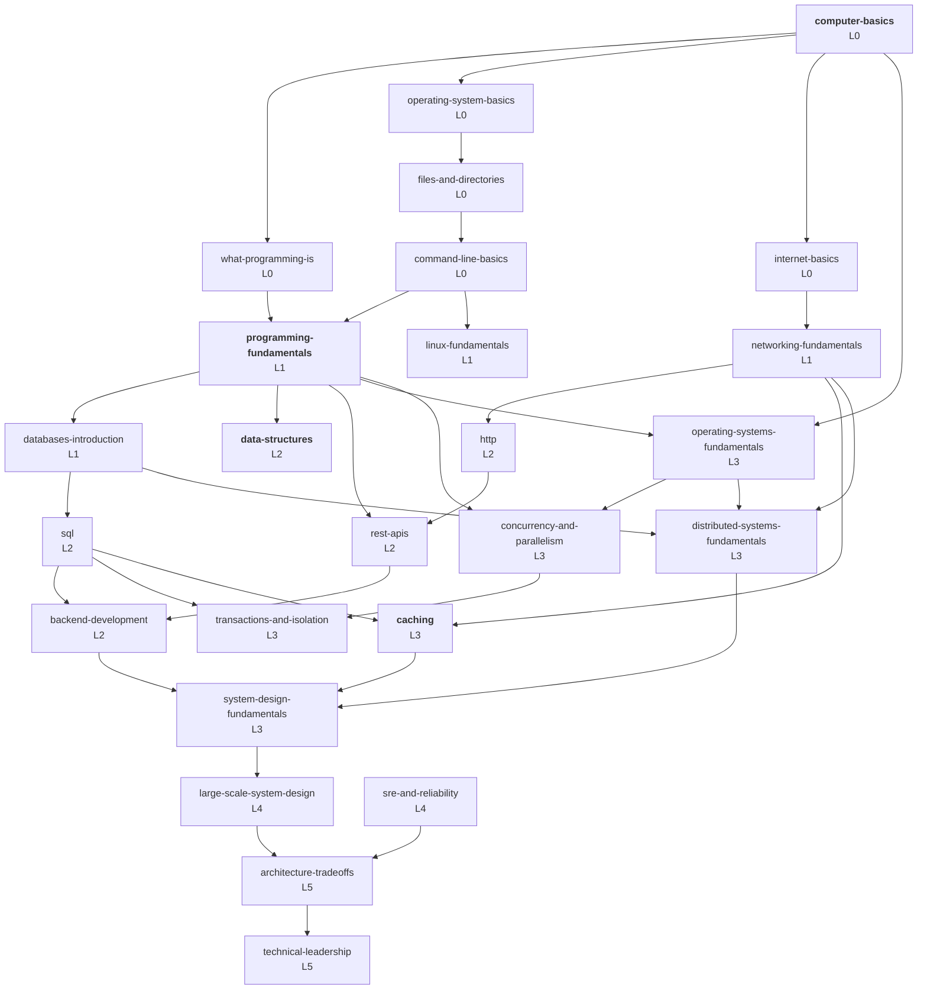
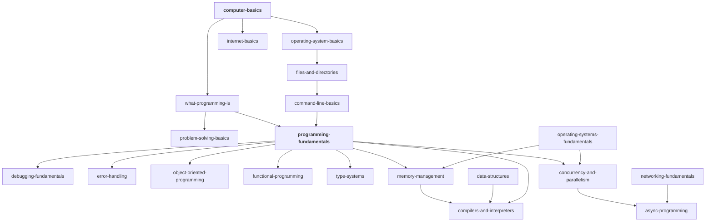
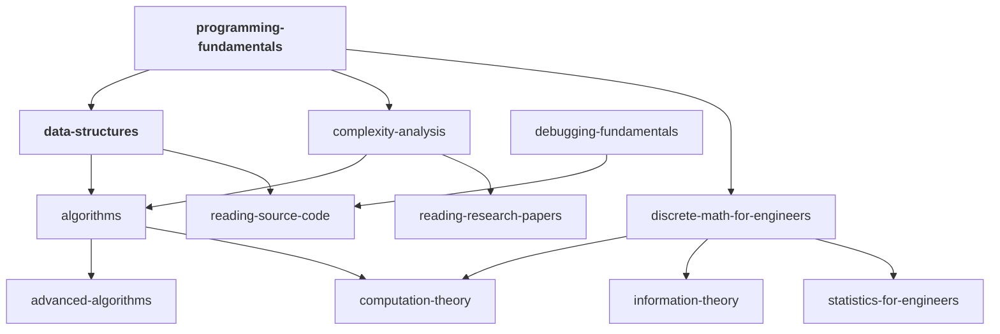
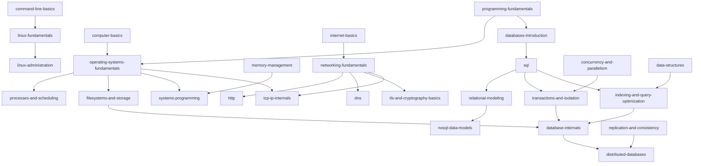
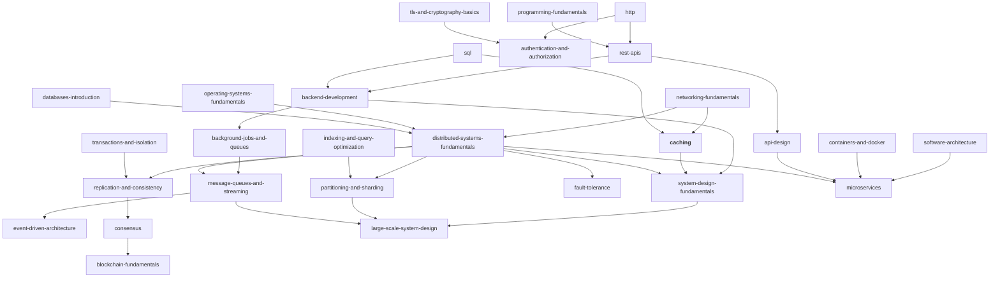
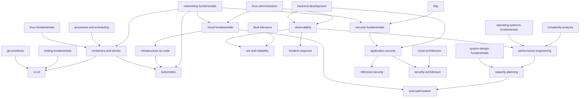

# The core dependency map

The prerequisite graph, drawn. Every edge here is a **hard prerequisite** declared in
[`registry/`](registry/) or a published `topic.yml`, and every edge is checked in CI: no cycles,
and no prerequisite at a higher level than the topic requiring it.

**Why this exists.** Learning order is not a matter of taste. "Learn Kubernetes" is not actionable
for someone who does not know what a process is, and the reason is a dependency, not an opinion.
This map is the answer to *what am I missing?* — which is the most useful question a learner can
ask and the hardest to answer alone.

**How to read it.** Arrows point from prerequisite to dependent: `A → B` means "learn A before B".
Diagrams are grouped by area for legibility; the graph itself is one connected structure, not
several.

**Bold** topics are written. Everything else is declared in the map and not yet written — see
[architecture.md §4](../docs/architecture.md#4-the-registry-and-the-no-empty-files-rule) for why
that is deliberate rather than a gap in the map.

---

## The spine

The path from nothing to production accountability, with only the load-bearing edges shown.



Four observations worth drawing from that shape:

**`programming-fundamentals` is the narrow gate.** Almost everything depends on it, directly or
transitively. It is also the longest single topic in the repository. Rushing it is the most
expensive possible saving.

**`operating-systems-fundamentals` is the second gate**, and it is the one people skip. Concurrency,
memory, containers, performance, and distributed systems all sit behind it. Skipping it is why
Kubernetes feels like magic and why race conditions feel like bad luck.

**`caching` and `distributed-systems-fundamentals` both feed `system-design-fundamentals`**, and
that is not an accident: system design is mostly reasoning about copies of data and about partial
failure.

**Level 5 has few inbound edges.** `architecture-tradeoffs` and `technical-leadership` depend on
comparatively little *knowledge*. What they require is experience, which the graph cannot express —
see [levels.md](../docs/levels.md#level-5--guru).

---

## Foundations and programming



---

## Computer science



Note that `reading-source-code` and `reading-research-papers` sit here structurally but are Level 4
`mastery` topics. Their prerequisites are modest; what makes them advanced is that they require
tolerating confusion for hours, which is a disposition rather than a dependency.

---

## Systems, networking, and databases



The database chain is the clearest example of the map's value. `database-internals` requires
indexing *and* transactions *and* filesystems — three L3 topics — which is why it is L4 and why
attempting it early produces memorisation rather than understanding.

---

## Backend, distributed systems, and system design



---

## Operations, cloud, and security



---

## First-principles chains

The dependency graph says *what order*. These chains say *why the thing exists*, which is what
makes it stick. Each is the `first_principles_chain` from a topic, compressed.

### Caching

```text
Why is this request slow?  → measure first
        ↓
Memory is ~1,000-1,000,000× closer than the alternatives
        ↓
Some data is read far more often than it changes        (locality)
        ↓
So keep a copy closer to the reader                    ← the cache
        ↓
Two copies of the truth exist; one can be wrong        (invalidation)
        ↓
The copy is smaller than the truth                     (eviction)
        ↓
Many readers can miss at once                          (stampedes)
        ↓
One machine's memory is not enough                     (distribution, consistent hashing)
        ↓
Redis, Memcached, CDNs and your CPU cache are implementations of the above
```

Full version: [caching/fundamentals.md](../topics/backend/caching/fundamentals.md).

### HTTP

```text
Two programs on different machines need to exchange documents
        ↓
Client/server, request/response, and statelessness — and what statelessness costs
        ↓
It needs an ordered, reliable byte stream                  → TCP
        ↓
The bytes are readable by anyone on the path               → TLS
        ↓
One request per connection is slow                         → keep-alive, HTTP/1.1
        ↓
Head-of-line blocking within a connection                  → multiplexing, HTTP/2
        ↓
Head-of-line blocking below TCP                            → QUIC, HTTP/3
```

### Data structures

```text
Memory is numbered slots; reaching one by number is fast
        ↓
Store items consecutively                        → array: O(1) index, O(n) insert
        ↓
Arrays cannot grow                               → dynamic array: amortised O(1) append
        ↓
Shifting is expensive                            → linked list: O(1) insert, poor locality
        ↓
Find by value, not position                      → hash table: O(1) average, O(n) adversarial
        ↓
Need order as well                               → BST: O(log n) if balanced
        ↓
Only need the extreme                            → heap: weaker invariant, cheaper
        ↓
Relationships are the data                       → graph
        ↓
And underneath: memory layout decides the constant factor, which decides your choice
```

Full version:
[data-structures/fundamentals.md](../topics/computer-science/data-structures/fundamentals.md).

### Containers

```text
Two programs on one machine need incompatible dependencies
        ↓
Give each its own view of the filesystem                    → mount namespaces
        ↓
And its own view of processes, network, users                → the other namespaces
        ↓
And a bound on the resources it may consume                  → cgroups
        ↓
That view should be shippable and reproducible               → images, layers
        ↓
Many of these across many machines need scheduling           → orchestration
        ↓
Docker automates the first four; Kubernetes automates the last
```

---

## Using the map

**"What should I learn next?"** Find what you have. Follow the arrows out. Or read a topic's
`next` field, which says *why* each candidate follows.

**"Why is this topic so hard?"** Check its hard prerequisites. Almost every "I just don't get X"
is a missing prerequisite one or two levels down — not a deficiency in you, and not a bad
explanation of X.

**"Can I skip this?"** Often yes. Look at what depends on it: if three later topics list it as a
hard prerequisite, skipping it defers the cost rather than removing it. Write down what you
skipped.

**"Where are the gaps in my knowledge?"** Take the level tests in
[levels.md](../docs/levels.md), then look at the L3–L4 topics you use daily but never studied
deliberately. Almost everyone has several; TLS, TCP internals, transaction isolation, and the
memory hierarchy are the usual ones.

---

## Querying the graph

The diagrams above are hand-maintained for readability. The authoritative graph is the YAML, and it
is queryable:

```bash
python3 tools/validate_graph.py --stats
```

which reports node counts by level, status, and domain; the number of hard edges; the entry points
(topics with no prerequisites); and the topics with the deepest transitive prerequisite trees.

If you add a topic whose edges change the shape of one of these diagrams, update the diagram in the
same pull request. It is the one piece of duplication the architecture accepts, because a rendered
map is worth the maintenance and no generator would produce diagrams this legible.
